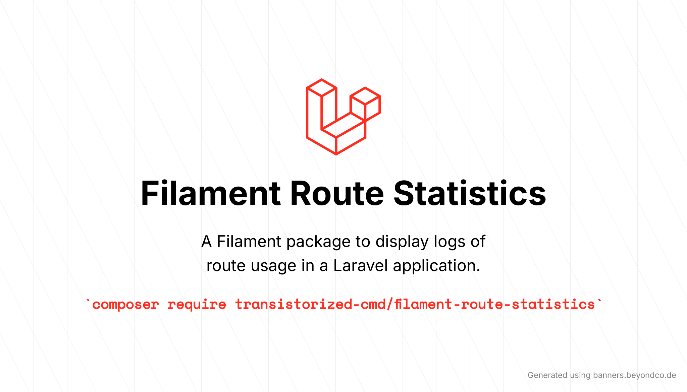
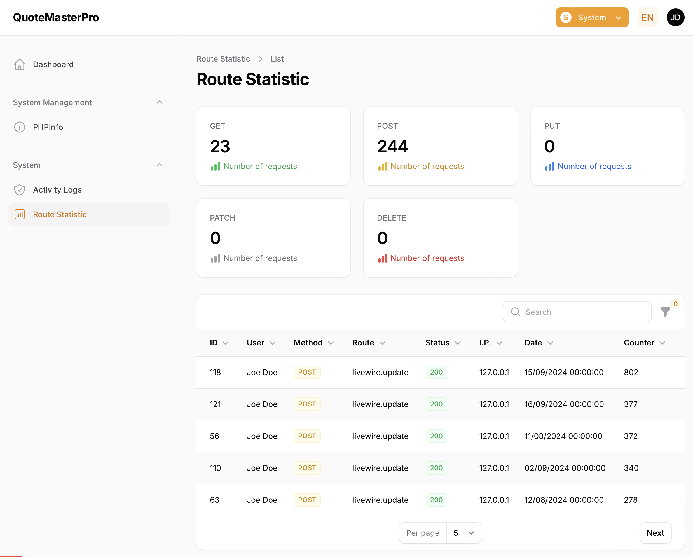
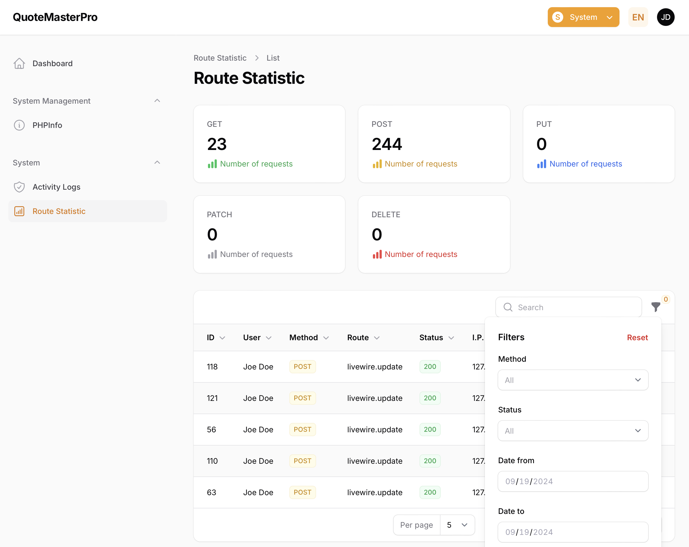

# Route Statistics

### A Filament interface for bilfeldt/laravel-route-statistics



[](LICENSE.md)

This package provides a Filament interface that displays the route statistics generated by the [bilfeldt/laravel-route-statistics package](https://github.com/bilfeldt/laravel-route-statistics).

## Requirements

-   Laravel v11
-   Filament v3
-   bilfeldt/laravel-route-statistics v3

## Languages Supported

The RouteStatistics plugin is translated for:

-   🇺🇸 English
-   🇲🇽 Spanish (mx)





## Installation

You can install the package via Composer:

```bash
composer require transistorized-cmd/filament-route-statistics
```

Activate the plugin in your panel:

```bash
use Transistorizedcmd\RouteStatistics\RouteStatisticsPlugin;

public function panel(Panel $panel): Panel
    {
        return $panel
            ->plugins([
                RouteStatisticsPlugin::make()
            ]);
    }
````

You can publish the config file (recommended)

```bash
php artisan vendor:publish --tag="filament-route-statistics-config"
```

To publish translations

```bash
php artisan vendor:publish --tag="filament-route-statistics-translations"
```

## Configuration

Below are the contents of the published config file:

```php
return [
    'resources' => [
        'navigation_group' => 'System',
        'navigation_icon' => 'heroicon-o-chart-bar-square',
        'navigation_sort' => 190,
        'default_sort_column' => 'id',
        'default_sort_direction' => 'desc',
        'navigation_count_badge' => false,
        'resource' => \Transistorizedcmd\RouteStatistics\Resources\RouteStatisticsResource::class
    ],
    'datetime_format' => 'd/m/Y H:i:s',
    'username' => 'name'
];
```

## License

The MIT License (MIT). Please see [License File](LICENSE.md) for more information.
